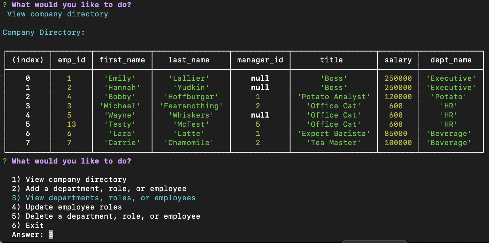

# Content Management System - Employee Tracker

## Project Description
Need a solution for managing your growing company's employees? 

This application allows the user to:
* View the company directory
* Add a department, role, or employee
* View departments, roles, or employees
* Update employee roles
* Delete a department, role, or employee

The information being stored in the database is customizable.

## Built With
* Node.js
* InquirerJS
* MySQL

## Preview

## Got Questions? 
### Ask Me:
* GitHub Profile: https://github.com/lalliere
* My Email: emilylallier@yahoo.com